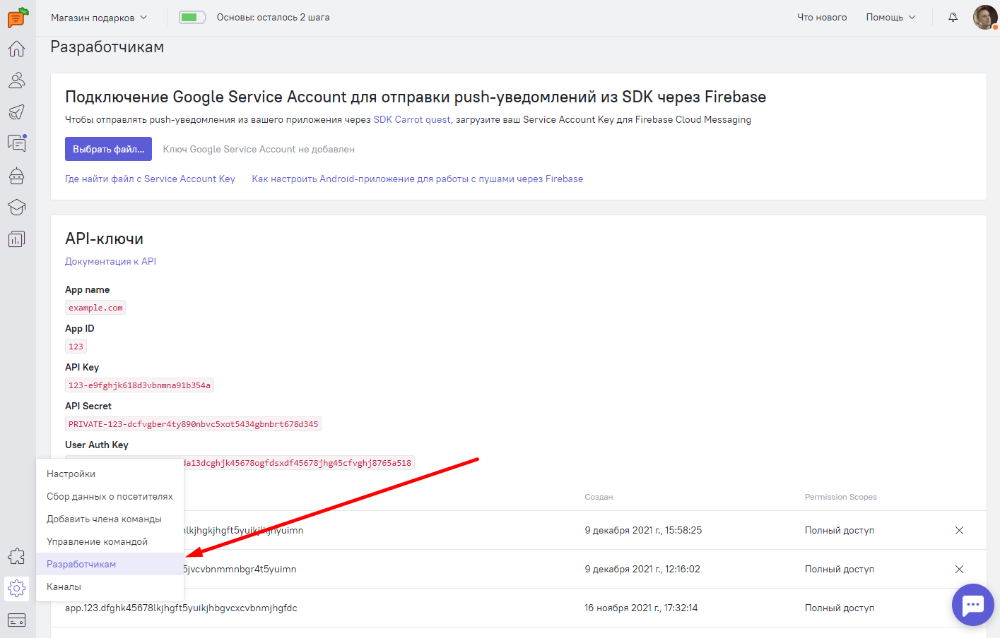

## Carrot quest для Android (Beta)

`Внимание!` Библиотека находится в стадии активной разработки. Возможны сбои в работе.

Carrot quest для Android поддерживает API 16 и выше.

## Установка
На данный момент Carrot quest для Android можно установить с помощью gradle.
Для этого добавьте репозиторий в `build.gradle` файле проекта:
```groovy
allprojects {
    ...
    repositories {
        ...
        maven { url "https://raw.github.com/carrotquest/android-sdk/beta" }
        maven { url "https://jitpack.io" }
    }
}
```
Укажите зависимости в `build.gradle` файле вашего приложения:
```groovy
android {
    ...
    defaultConfig {
        ...
        multiDexEnabled true
    }
}

dependencies {
    ...
    implementation 'com.android.support:multidex:1.0.3'
    implementation 'io.carrotquest:android-sdk:1.0.5-commonRelease'
}
```

Библиотека использует Java 8. Если ваш проект использует версию Java ниже 8, добавьте следующие настройки:
```groovy
android {
    ...
    compileOptions {
        sourceCompatibility 1.8
        targetCompatibility 1.8
    }
}
```


## Инициализация
Для работы с Carrot quest для Android вам понадобится API Key и User Auth Key. Вы можете найти эти ключи на вкладке Настройки > API Ключи:


Для инициализации Carrot quest вам нужно выполнить следующий код в методе onCreate() вашего приложения:

```java
Carrot.setup(this, apiKey);
```

Для вывода дополнительной информации во время отладки используйте метод:
```java
Carrot.isDebug(true);
```

## Авторизация пользователей

Если в вашем приложении присутствует авторизация пользователей, вы можете передать id пользователя в Carrot:

```java
Carrot.auth(userId, userAuthKey);
```

## Свойства пользователей и события

Вы можете установить необходимые свойства пользователя с помощью
```java
Carrot.setUserProperty(userProperty);
Carrot.setUserProperty(userPropertyList);
```

Для описания свойств пользователя используйте класс `UserProperty`
```java
public UserProperty(String key, String value)
public UserProperty(Operation operation, String key, String value)
```
Более подробно про `Operations` можно прочитать в разделе [«Cвойства пользователя»](https://carrotquest.io/developers/props/#_3).

`Внимание!`

Поле `key` не может начинаться с символа `$`.


Для установки [системных свойств](https://carrotquest.io/developers/props#_4) реализовано 2 класса `CarrotUserProperty` и `EcommerceUProperty`.

Для отслеживания событий используйте
```java
Carrot.trackEvent(eventName);
```
Вы можете указать дополнительные параметры для события в виде JSON-строки и передать их в метод
```java
Carrot.trackEvent(eventName, eventParams);
```

## Чат с оператором
Вы можете дать пользователю мобильного приложения возможность перейти в чат с оператором из любого места. Это можно реализовать двумя разными путями - через плавающую кнопку, либо напрямую вызвав метод открытия чата в любое нужное время.

### Плавающая кнопка (Floating Button)
По своей сути - это элемент интерфейса, наследующийся от `ConstraintLayout`. Вы можете встроить его в свою разметку:
``` xml
<io.carrotquest_sdk.android.ui.FloatingButton
        android:id="@+id/cq_sdk_float_button"
        android:layout_width="match_parent"
        android:layout_height="match_parent"
        app:cq_location_fab="BOTTOM_RIGHT"
        app:cq_visibility_background="false"
        app:cq_icon_fab="@drawable/ic_send"
        app:cq_margin_fab="8dp"
/>
```
У этого элемента есть свои атрибуты: 
* `app:cq_location_fab` отвечает за расположение плавающей кнопки относительно её родительского контейнера. Возможны 4 варианта - `TOP_LEFT`, `TOP_RIGHT`, `BOTTOM_LEFT`, `BOTTOM_RIGHT`. По умолчанию `BOTTOM_RIGHT`.
* `app:cq_visibility_background` отвечает за видимость эффекта затемнения при нажатии на плавающую кнопку. По умолчанию `true`. 
* `app:cq_icon_fab` задаёт иконку плавающей кнопки. По умолчанию `@id/ic_cq_message`.
* `app:cq_margin_fab` задаёт отступы плавающей кнопки относительно своего родительского контейнера. По умолчанию `16dp`.

#### Интерфейс плавающей кнопки
Доступные методы для настройки и управления поведением плавающей кнопки.

``` java
/**
 * Показать плавающую кнопку
 */
public void showFab()
```

``` java
/**
 * Скрыть плавающую кнопку
 */
 public void hideFab()
```

``` java
/**
 * Показать кнопки интеграции
 */
public void expandMenu()
```

``` java
/**
 * Скрыть кнопки интеграции
 */
public void collapseMenu()
```

``` java
/**
 * Установить иконку чата
 * @param iconFAB Иконка
 */
public void setIconFAB(Drawable iconFAB)
```

``` java
/**
 * Установить отступы кноки от краев экрана
 * @param margin Значение отступа
 */
public void setMarginFAB(int margin) 
```

``` java
/**
 * Установить расположение кнопки
 * @param location Расположение кнопки
 */
public void setLocationFAB(LocationFAB location)
```


### Открытие чата из произвольного места
Открыть чат можно также, вызвав из произвольного места (после инициализации) следующий код:
 ```java
 Carrot.openChat(context);
 ```
 
 ### Уведомления
 Для работы с уведомлениями SDK использует сервис Firebase Cloud Messaging. В связи с этим на данном этапе необходимо получить ключ и отправить его нам в поддержку. Процесс настройки сервиса Firebase Cloud Messaging описан [здесь](https://firebase.google.com/docs/cloud-messaging?authuser=0)
 
 Иконку уведомлений можно настравивать используя метод 
 ``` java
Carrot.setNotificationIcon(notificationIconId)
```
где `notificationIconId` - это идентификатор ресурса иконки.
